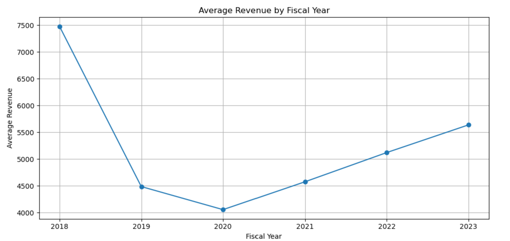

# Stock Fundamentals Analysis

This project explores financial data across public companies to identify trends and relationships using Python and pandas. It includes analysis of earnings per share, price ratios, and data distribution across industries.

## 🛠 Tools & Languages
- Python (pandas, matplotlib, seaborn)
- Jupyter Notebook

## 📁 Files
- `HW2_Ramchandani_Simrin.ipynb`: Full notebook with code and visualizations
- `comp_funda_HW.csv`: Input dataset of company fundamentals

## 📌 Key Highlights
- Cleaned and analyzed company-level financial data
- Visualized relationships between earnings and stock price
- Compared company fundamentals across industries

This project helped me practice exploratory data analysis and improve how I use visualizations to tell a financial story.

## 📷 Sapmle Visualization: 

This line graph shows the trend of average company revenue over time based on the dataset.

